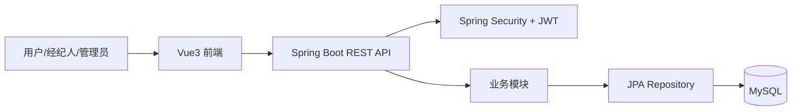
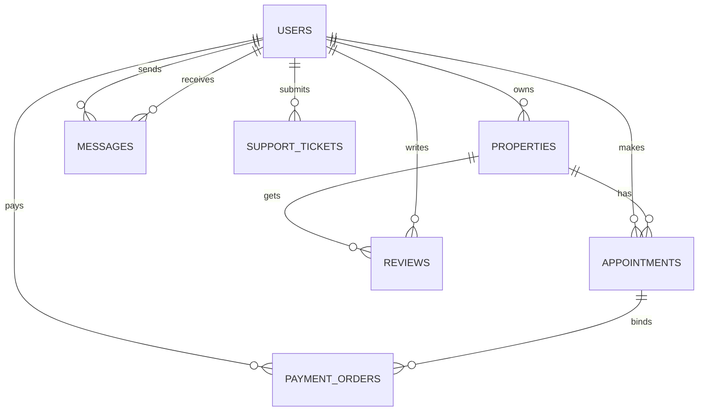
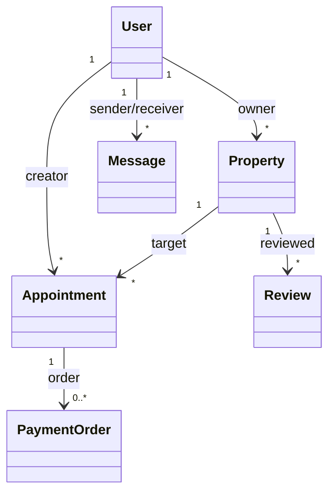
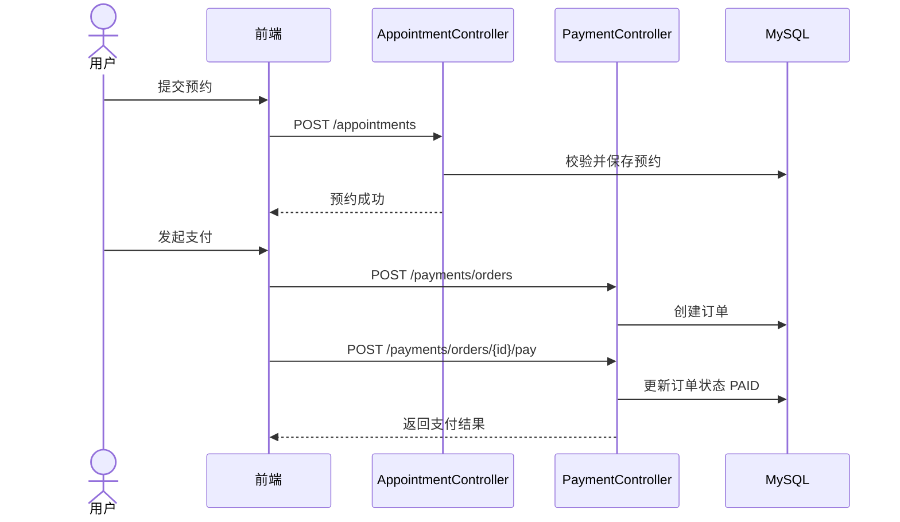
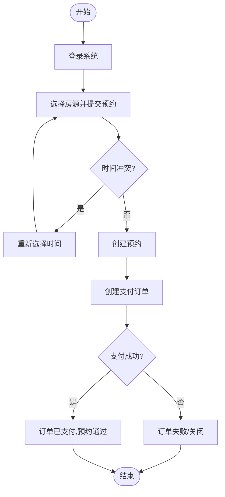

# 基于 Spring Boot 与 Vue 的智能房源推荐与预约平台设计与实现

## 摘要
随着城市化进程加速和住房需求多样化，传统房源信息平台在信息匹配效率、交互体验和业务闭环方面仍存在不足。本文围绕毕业设计项目“智能房源推荐与预约平台”，完成了从需求分析、系统设计、开发实现到测试验证的全流程研究与实践。系统采用前后端分离架构，前端基于 Vue3、Vite、Element Plus 构建交互界面，后端基于 Spring Boot、Spring Security、JWT 与 JPA 提供统一业务服务，数据库采用 MySQL，实现了用户认证、房源管理、预约看房、支付订单、价格订阅提醒、消息沟通、工单支持与数据统计等核心功能。

在系统设计阶段，本文给出了系统架构图、数据库 ER 图、类图、时序图和活动图，并结合关键业务场景对静态结构与动态流程进行论证。测试结果表明，该系统在主要功能流程中具有良好的可用性与稳定性，能够满足毕业设计场景下的业务需求。本文最后总结了系统实现经验与不足，并提出后续在推荐算法优化、异步消息解耦和部署工程化方面的改进方向。

**关键词**：毕业设计；房源平台；Spring Boot；Vue3；系统设计；ER 图

---

## 第一章 绪论
### 1.1 研究背景
互联网房产服务已从单一信息展示演进为“看房、沟通、预约、支付、售后”一体化服务。传统系统常见问题包括：
1. 房源检索与个性化推荐能力不足。
2. 用户与经纪人沟通分散，流程不连贯。
3. 预约、支付、售后等业务环节缺少统一平台支持。

因此，构建一个围绕用户完整看房链路的智能化平台，具有较高的工程实践与应用价值。

### 1.2 研究目的与意义
本文旨在完成一个可运行、可展示、可扩展的毕业设计系统，通过规范的软件工程流程，体现需求分析、系统设计、编码实现与测试验证能力。其意义体现在：
1. 提升房源信息管理与交易流程协同效率。
2. 为后续引入 AI 辅助推荐与智能问答提供基础。
3. 为毕业设计论文提供完整、可追溯的技术材料。

### 1.3 研究内容
本文主要工作如下：
1. 完成业务需求分析与功能模块划分。
2. 设计前后端分离的系统总体架构。
3. 构建数据库模型并实现核心实体关系。
4. 实现用户、房源、预约、支付、消息、工单等模块。
5. 开展功能测试与流程验证，形成结论与展望。

### 1.4 论文结构
全文共七章：绪论、相关技术简介、系统需求分析、系统概要设计、详细设计与实现、系统测试、结论与展望。

---

## 第二章 相关技术简介
### 2.1 前端技术
1. Vue3：采用组合式开发思想，便于组件复用与业务拆分。
2. Vite：提供快速构建与热更新能力，提升开发效率。
3. Element Plus：实现统一风格的表单、表格、对话框等交互组件。
4. Axios：封装 HTTP 请求，与后端 REST API 对接。

### 2.2 后端技术
1. Spring Boot：构建 REST 服务，简化配置与部署。
2. Spring Security + JWT：实现无状态认证与接口访问控制。
3. Spring Data JPA：简化数据访问层开发，提高开发效率。
4. Maven：统一依赖管理与构建流程。

### 2.3 数据库与辅助技术
1. MySQL：存储业务数据，支撑事务一致性。
2. BCrypt：用户密码加密存储，提升安全性。
3. ECharts、Leaflet：用于统计可视化与地图展示。

---

## 第三章 系统需求分析
### 3.1 可行性分析
1. 技术可行性：所选技术栈成熟稳定，具备完整生态支持。
2. 经济可行性：开发环境与基础设施成本较低，适合毕业设计。
3. 操作可行性：系统界面直观，普通用户可快速上手。

### 3.2 角色与功能需求
系统主要角色为普通用户、经纪人和管理员。

普通用户需求：
1. 注册、登录、查看个人信息。
2. 浏览与筛选房源，查看详情。
3. 发起预约、完成支付、查看进度。
4. 发送消息、提交工单、订阅降价提醒。

经纪人与管理员需求：
1. 房源发布与维护、预约处理。
2. 工单处理与状态流转。
3. 平台数据统计与业务监管。

### 3.3 非功能需求
1. 安全性：密码加密、接口鉴权、权限控制。
2. 可用性：关键流程明确，操作反馈及时。
3. 可维护性：模块化设计，前后端职责清晰。
4. 可扩展性：支持后续 AI 推荐与服务拆分。

---

## 第四章 系统概要设计
### 4.1 总体架构设计
系统采用前后端分离三层架构：
1. 表现层：Vue3 前端页面与组件。
2. 业务层：Spring Boot 控制器、服务、权限与业务规则。
3. 数据层：JPA Repository 与 MySQL 数据库。

### 4.2 系统架构图（必需图表）
> 图 4-1 系统架构图（论文排版时插入截图）

### 4.3 功能模块划分
1. 用户与认证模块。
2. 房源管理模块。
3. 预约看房模块。
4. 支付订单模块。
5. 消息与提醒模块。
6. 工单与统计模块。

---

## 第五章 详细设计与实现
### 5.1 数据库设计
#### 5.1.1 实体说明
核心实体包括：`users`、`properties`、`appointments`、`payment_orders`、`messages`、`reviews`、`house_requirements`、`support_tickets` 等。

#### 5.1.2 数据库 ER 图（必需图表）
> 图 5-1 数据库 ER 图（论文排版时插入生成截图）

### 5.2 类设计
#### 5.2.1 核心类关系
核心类包括 `User`、`Property`、`Appointment`、`PaymentOrder`、`Message`、`Review` 等。

#### 5.2.2 类图（必需图表）
> 图 5-2 类图（论文排版时插入生成截图）

### 5.3 关键业务流程设计
#### 5.3.1 预约与支付时序
> 图 5-3 时序图（必需图表）

#### 5.3.2 预约活动流程
> 图 5-4 活动图（必需图表）

### 5.4 核心实现说明
1. 认证实现：`/auth/login` 登录后签发 JWT，后续接口按权限访问。
2. 房源实现：支持房源增删改查、状态更新、搜索过滤。
3. 预约实现：支持冲突校验与预约状态流转。
4. 支付实现：支持订单创建、模拟支付、回调验签与凭证生成。
5. 消息提醒：价格订阅触发后生成站内消息。

### 5.5 代码截图与项目截图（必需图表）
> 图 5-5 关键代码截图（Controller/Service/Repository）
> 图 5-6 项目运行截图（首页、房源详情、预约、支付、后台）

说明：以上截图在最终排版时按章节依次插入，并标注图号与图题。

---

## 第六章 系统测试
### 6.1 测试环境
1. 操作系统：Windows 11。
2. 后端环境：JDK 17、Maven、Spring Boot。
3. 前端环境：Node.js、Vite、Vue3。
4. 数据库：MySQL 8.x。

### 6.2 功能测试
1. 用户模块测试：注册、登录、权限校验通过。
2. 房源模块测试：查询、发布、编辑、状态更新通过。
3. 预约模块测试：冲突检测有效，状态流转正确。
4. 支付模块测试：订单创建、支付、凭证查询流程完整。
5. 消息与工单测试：提交、查询、状态更新符合预期。

### 6.3 测试结果分析
系统主要功能均达到预期，接口响应稳定，核心业务链路完整。对于异常输入与权限越权场景，系统可返回明确错误信息并阻止非法操作。

---

## 第七章 结论与展望
### 7.1 结论
本文完成了一个基于 Spring Boot 与 Vue 的房源推荐与预约平台设计与实现，形成了较完整的软件工程成果。系统在架构、数据模型、业务流程和可视化展示方面满足毕业设计要求，并具备进一步扩展能力。

### 7.2 不足
1. 推荐策略仍以规则为主，个性化深度有限。
2. 消息通知以站内为主，未全面接入短信/邮件网关。
3. 尚未进行高并发压力测试与云端部署优化。

### 7.3 展望
1. 引入机器学习模型提升推荐精度。
2. 采用消息队列优化异步流程与可扩展性。
3. 完成容器化部署与持续集成，提高工程化水平。

---

## 致谢
感谢指导老师在选题、设计、实现和论文撰写过程中提供的持续指导与支持，感谢同学在测试与意见反馈方面给予的帮助。

## 参考文献（示例）
[1] Craig Walls. Spring Boot in Action[M]. Manning, 2016.
[2] Evan You. Vue.js 官方文档[EB/OL]. https://vuejs.org/
[3] Ian Goodfellow, Yoshua Bengio, Aaron Courville. Deep Learning[M]. MIT Press, 2016.
[4] 王珊, 萨师煊. 数据库系统概论[M]. 高等教育出版社.

---

## 附录 A：毕业设计论文规范与进度管理指导会纪要（整合版）
会议主题：毕业设计论文规范与进度管理指导会  
发言人：刘权达、邱汉林  
会议摘要：本次会议明确了毕业设计论文章节结构与图表规范，强调查重与开题报告格式要求，并建立每周汇报机制把控整体进度。

一、论文结构与内容规范
1. 章节逻辑与核心要素
- 标准章节架构：绪论、相关技术简介、系统需求分析、系统概要设计、详细设计与实现、系统测试、结论。
- 图表完整性要求：系统架构图、数据库 ER 图、类图、时序图、活动图、代码截图、项目截图为必需内容。

2. 学术诚信与语言规范
- 查重红线：禁止直接抄袭，AI 仅可辅助表达，最终内容必须原创。
- 格式细则：统一小四号字体、1.25 倍行距、无段间距。

二、进度管理与汇报机制
1. 周期性汇报制度
- 每周或每两周一次例行汇报。
- 下次汇报重点：章节理解、ER 图与数据表设计掌握情况。

2. 开题报告提交流程
- 先交导师修订，再按统一通知提交系统。
- 下周或下下周提交技术选型文档，说明前后端及 AI 技术栈。

三、技术指导与支持
1. 问题解决渠道
- 开发过程遇到技术问题可通过微信联系导师。
- 类图、活动图等规范与放置位置将在后续会议重点说明。

2. 考核侧重点
- 毕业设计通过关键在论文质量。
- 代码需交流，但最终考核更重视论文规范性与完整性。
